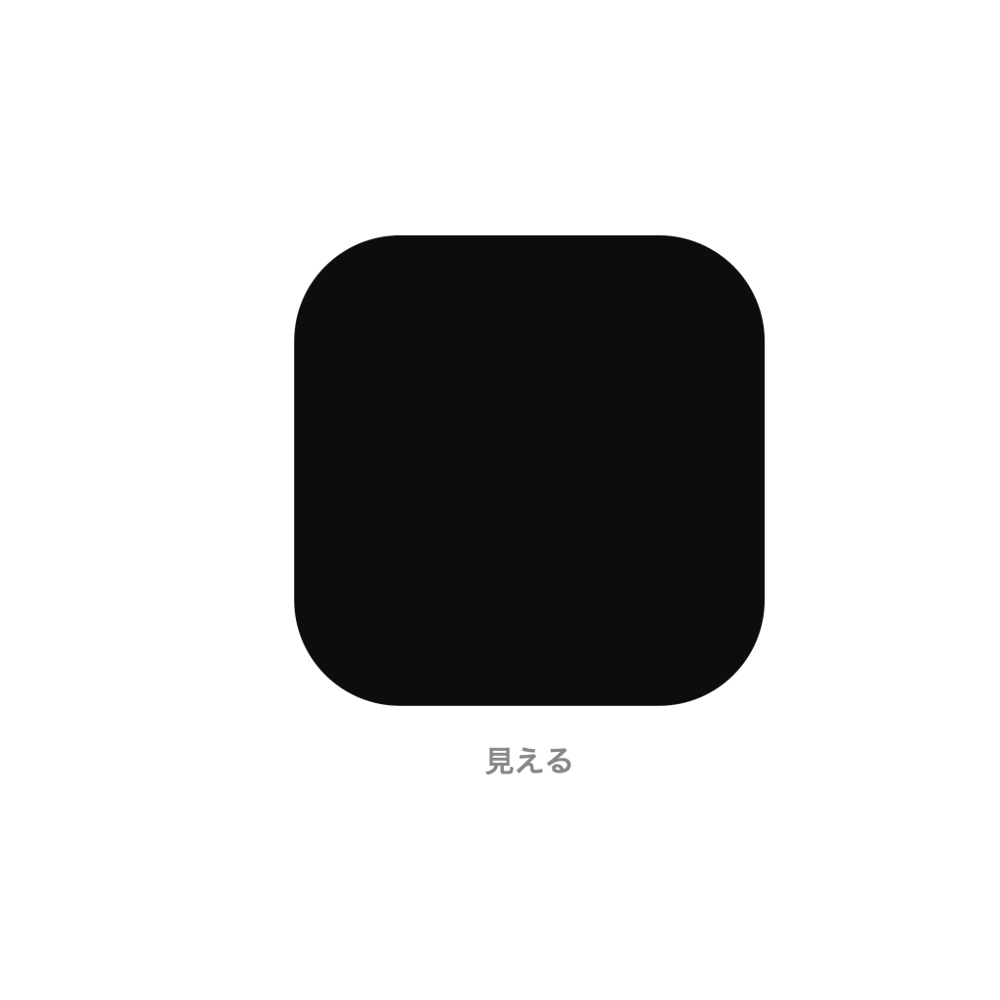

<div align="center">



# Mieru

### On-device camera AI that identifies what you see — powered by Gemma 4 on iPhone.

**見える** (mieru) — *"to see / to be visible"*

<br>

[](https://swift.org)
[](https://developer.apple.com/ios/)
[](https://github.com/ml-explore/mlx-swift)
[](https://huggingface.co/mlx-community/gemma-4-e2b-it-4bit)
[](LICENSE)

<br>

</div>

---

## Overview

Mieru is an iPhone app that uses the camera and an on-device vision-language model (Gemma 4 E2B) to identify whatever you point it at. It names brands, products, people, places, and objects directly — no cloud, no API keys, everything runs on the device GPU via Metal.

The UI is inspired by Dragon Quest text boxes with typewriter animation, blip sound effects, and a Siri-style edge glow while the AI is thinking.

---

## Pipeline

```
iPhone Camera → AVCaptureSession (~10 FPS throttle)
                    │
                    ├──→ CameraPreviewView (live feed)
                    │
                    └──→ User taps「しらべる」
                              │
                              ├──→ Capture latest CVPixelBuffer
                              │
                              ├──→ Downscale to 512px
                              │
                              ├──→ Gemma 4 E2B (4-bit, MLX Swift, GPU via Metal)
                              │         │
                              │         ├──→ System prompt (EN or JA)
                              │         └──→ "What is this?" / "これは何？"
                              │
                              └──→ DQ Text Box (typewriter + blip SFX)
                                        │
                                        ├──→ Auto-scroll during typing
                                        ├──→ ▼ cursor blink when done
                                        └──→「キャンセル」to abort
```

---

## Features

### On-Device AI
- **Gemma 4 E2B 4-bit** via MLX Swift — runs entirely on iPhone GPU (Metal)
- **No cloud dependency** — no API keys, no internet needed after model download
- **Sequential loading** — camera starts first, model loads after to avoid OOM
- **Lazy fallback** — if model isn't loaded at capture time, triggers load + auto-capture
- **~1.5 GB model** downloaded from HuggingFace on first launch (cached locally)

### Dragon Quest UI
- **DQ text box** — double-bordered box with typewriter text reveal
- **Blip SFX** — procedurally generated 8-bit square wave blip (660Hz, 60ms) per character
- **しらべる / キャンセル** — DQ-style action buttons with blinking ▶ cursor
- **Bouncing dots** — animated thinking indicator while AI processes
- **▼ triangle cursor** — blinks when text is fully revealed
- **Siri edge glow** — animated gradient border pulses while thinking

### Language Toggle
- **EN / JA** toggle in top-right corner
- Switches both system prompt and user prompt
- JA: direct identification in Japanese
- EN: direct identification in English

### Smart UX
- **Auto-scroll** — text box scrolls as typewriter types
- **Scroll pause** — scrolling pauses when user drags up to read
- **Scroll resume** — resumes auto-scroll when user drags back to bottom
- **Cancel** — stops typewriter, clears text, discards pending AI result
- **Generation tracking** — stale results from cancelled requests are silently discarded

---

## Architecture

```
┌──────────────────────────────────────────────────────────┐
│                     Mieru App                             │
│                                                           │
│  ┌─────────────┐  ┌─────────────┐  ┌──────────────────┐ │
│  │ ContentView  │  │ CameraManager│  │ VLMService       │ │
│  │ Main layout  │  │ AVCapture    │  │ Gemma 4 E2B      │ │
│  │ State mgmt   │  │ Frame grab   │  │ MLX Swift        │ │
│  │ Lifecycle    │  │ 10 FPS cap   │  │ HuggingFace DL   │ │
│  └──────┬──────┘  └──────────────┘  └──────────────────┘ │
│         │                                                  │
│  ┌──────┴──────┐  ┌─────────────┐  ┌──────────────────┐ │
│  │ DQTextBoxView│  │ControlsOverlay│ │ SiriEdgeGlow    │ │
│  │ Typewriter   │  │ しらべる btn │  │ Animated border  │ │
│  │ Auto-scroll  │  │ キャンセル   │  │ Angular gradient │ │
│  │ Blip SFX     │  │ Lang toggle  │  │ Pulse + rotate   │ │
│  └──────────────┘  └─────────────┘  └──────────────────┘ │
└──────────────────────────────────────────────────────────┘
```

---

## Key Files

| File | Purpose |
|------|---------|
| `ContentView.swift` | Main view: camera + text box + controls layout, capture flow, lifecycle |
| `CameraManager.swift` | AVCaptureSession wrapper, frame delivery at ~10 FPS, start/stop |
| `VLMService.swift` | Gemma 4 E2B via MLX — download, load, inference with EN/JA prompts |
| `DQTextBoxView.swift` | DQ text box with typewriter animation, auto-scroll, bouncing dots |
| `ControlsOverlay.swift` | しらべる / キャンセル buttons with DQ styling |
| `LanguageToggle.swift` | EN/JA toggle button |
| `SiriEdgeGlow.swift` | Animated edge glow with angular gradient rotation and pulse |
| `TypewriterSFX.swift` | Procedural 8-bit blip generator (square wave WAV in memory) |
| `CameraPreviewView.swift` | UIViewRepresentable wrapper for AVCaptureVideoPreviewLayer |

---

## Model

| Property | Value |
|----------|-------|
| **Model** | [gemma-4-e2b-it-4bit](https://huggingface.co/mlx-community/gemma-4-e2b-it-4bit) |
| **Architecture** | Gemma 4 (Vision-Language Model) |
| **Quantization** | 4-bit (MLX format) |
| **Size** | ~1.5 GB |
| **Compute** | GPU via Metal (MLX Swift) |
| **Framework** | [mlx-swift](https://github.com/ml-explore/mlx-swift) 0.30.6+ |
| **VLM Support** | [mlx-swift-lm](https://github.com/adrgrondin/mlx-swift-lm) (port/gemma-4-model branch) |
| **Tokenizer** | [swift-transformers](https://github.com/huggingface/swift-transformers) 1.0.0+ |
| **Hub** | [swift-huggingface](https://github.com/huggingface/swift-huggingface.git) 0.9.0+ |
| **Cache limit** | 20 MB GPU cache (minimizes resident memory) |
| **Temperature** | 0.6 |
| **Max tokens** | 150 |

> **Note:** The mlx-swift-lm fork requires a one-time patch — add `import Tokenizers` to `Gemma4.swift` in the SPM checkout until the fork merges the fix.

---

## Requirements

- **iPhone** with iOS 17.0+ and at least 8 GB RAM
- **Xcode 16+**
- `increased-memory-limit` entitlement (included)
- ~1.5 GB storage for model (downloaded on first launch)
- Must be launched **from home screen** (not Xcode debugger) to avoid OOM from debugger overhead

---

## Setup

### 1. Clone

```bash
git clone https://github.com/jonpol01/mieru.git
cd mieru
```

### 2. Patch SPM dependency

After Xcode resolves packages, add `import Tokenizers` to the top of:

```
DerivedData/Mieru-*/SourcePackages/checkouts/mlx-swift-lm/Libraries/MLXVLM/Models/Gemma4.swift
```

### 3. Build and run

Build on a **physical device** (needs camera + Metal GPU). The model downloads from HuggingFace on first launch — progress is shown in the status bar.

> **Important:** Launch from the home screen, not Xcode's debugger, to get the full memory budget.

---

## Memory Management

Running a VLM on iPhone requires careful memory handling:

| Strategy | Detail |
|----------|--------|
| **Sequential loading** | Camera starts first, model loads only after `isRunning == true` |
| **Lazy fallback** | If model isn't ready at capture time, loads then auto-captures |
| **20 MB GPU cache** | Keeps Metal cache small to reduce resident memory |
| **Background unload** | Model fully unloaded when app backgrounds (`MLX.GPU.clearCache()`) |
| **Increased memory entitlement** | `com.apple.developer.kernel.increased-memory-limit` in entitlements |
| **No debugger** | Must launch from home screen — debugger adds ~200 MB overhead |

---

<div align="center">

**Built with Swift, MLX, and Gemma 4 on iPhone GPU**

</div>
